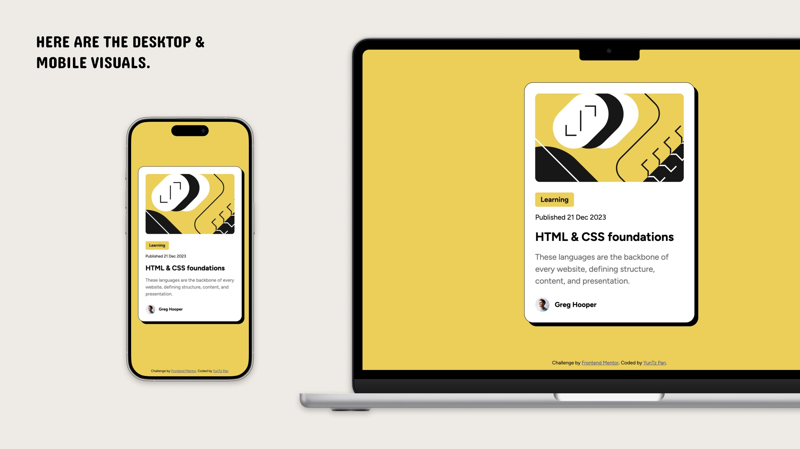

# Frontend Mentor - Blog preview card solution

這是 Frontend Mentor 上的 Blog preview 線上挑戰，幫助你透過實作專案來提升技能。

This is a solution to the [Blog preview card challenge on Frontend Mentor](https://www.frontendmentor.io/challenges/blog-preview-card-ckPaj01IcS). Frontend Mentor challenges help you improve your coding skills by building realistic projects.

## Table of contents

- [Overview](#overview)
  - [The challenge](#the-challenge)
  - [Screenshot](#screenshot)
  - [Links](#links)
- [My process](#my-process)
  - [Built with](#built-with)
  - [What I learned](#what-i-learned)
  - [Continued development](#continued-development)
  - [Useful resources](#useful-resources)
- [Author](#author)

## Overview

這是一個線上挑戰，模擬拿到設計稿後，前端實作切版，製作時間約 4hr。

This is an online challenge simulating the process of receiving design files and implementing the front-end layout. The estimated time for completion is approximately 4 hours.

### The challenge

挑戰重點：

- 使用者要能看見 hover & focus 的互動變化

Users should be able to:

- See hover and focus states for all interactive elements on the page

### Screenshot



### Links

- Solution URL: [View solution here](https://github.com/yyuntzpan/OnlineChallenge_blog-preview-card)
- Live Site URL: [View live site here](https://challenge02-blog-preview-card.vercel.app/)

## My process

### Built with

- Semantic HTML5 markup
- CSS custom properties
- Flexbox
- Mobile-first workflow

### What I learned

- 只要父容器設定 align-content: center + height，搭配子容器 margin-auto 就可以實現垂直及水平置中

- As long as the parent container is set to align-content: center and given a height, with the child container having margin: auto, it is possible to achieve both vertical and horizontal centering.

```css
body {
  align-content: center;
  height: 100vh;
}
.card {
  margin: auto;
}
```

- 想要讓字體大小能根據裝置大小調整，嘗試使用 font-size: clamp(12px, 2.5vw, 16px) 來實現

- To make the font size adjust according to the device size, I’m trying to use font-size: clamp(12px, 2.5vw, 16px).

```css
:root {
  font-size: clamp(12px, 2.5vw, 16px);
}
```

### Continued development

未來專案要使用 tailwind 來加快切版速度，並且使用框架，如 REACT。

In future projects, I plan to use Tailwind to speed up the layout process and work with React to become more familiar with the framework.

### Useful resources

- [explainthis](https://www.explainthis.io/zh-hant/swe/css-center)

## Author

- Github - [YunTZ Pan](https://github.com/yyuntzpan)
- Frontend Mentor - [@yyuntzpan](https://www.frontendmentor.io/profile/yyuntzpan)
